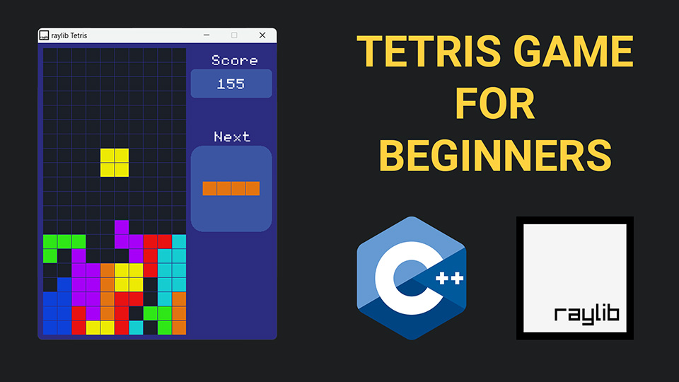

# C++ Tetris Game using raylib

A fully functional Tetris game built with C++ and raylib — featuring graphics, input handling, audio, collision detection, and a clean class-based architecture. A great resource for aspiring game developers looking to learn raylib game programming.

  

  

---

## What you'll learn

| | Topic | Details |
|---|---|---|
| 🪟 | **Game window setup** | Initialise raylib and configure the game loop |
| 🟦 | **Grid & block classes** | Clean object-oriented design for the Tetris board |
| 💥 | **Collision detection** | Prevent blocks from overlapping or leaving bounds |
| 🔊 | **Sound effects** | Add audio feedback using raylib's audio API |
| 🎮 | **Input handling** | Keyboard controls for movement and rotation |

---

## What's inside

The repository contains the full source code for the game — well-structured and easy to read, with every class and function explained in the accompanying video tutorial.

The game runs on **Windows**, **macOS**, and **Linux**.

---

## Resources

🎥 [Video Tutorial on YouTube](https://youtu.be/wVYKG_ch4yM)
&nbsp;&nbsp;|&nbsp;&nbsp;
📺 [My YouTube Channel](https://www.youtube.com/channel/UC3ivOTE5EgpmF2DHLBmWIWg)
